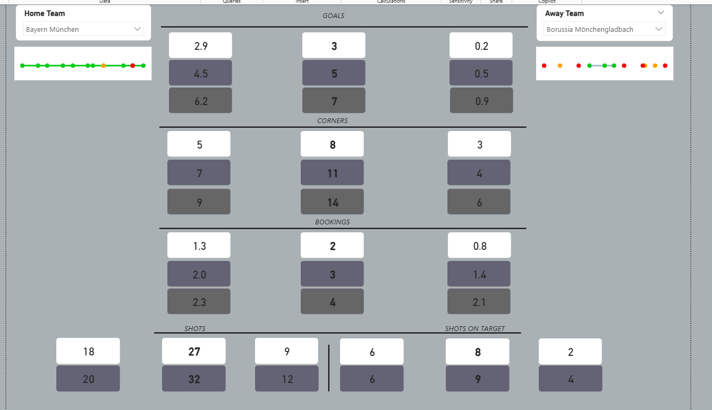

---

## 🧠 What This Is

This is a fully operational, end-to-end football match prediction system that I built independently — powered by automated Python data pipelines, statistical ensemble modelling, and an interactive Power BI dashboard.

Every week, after all matches have been played, the pipeline automatically collects fresh data, retrains on the latest results, and outputs structured predictions for the upcoming matchday across **all Top 5 European leagues**.

This is not a proof-of-concept. It runs every week on real data and delivers real predictions.

---

## 🏆 Leagues Covered

| League | Country |
|---|---|
| Premier League | 🏴󠁧󠁢󠁥󠁮󠁧󠁿 England |
| La Liga | 🇪🇸 Spain |
| Bundesliga | 🇩🇪 Germany |
| Serie A | 🇮🇹 Italy |
| Ligue 1 | 🇫🇷 France |

---

## 📊 What It Predicts

For every match across all 5 leagues, the model generates predictions for:

- ⚽ **Goals** — Home, Away, and Total
- 📐 **Corners** — Home, Away, and Total
- 🟨 **Bookings** — Home, Away, and Total
- 🎯 **Shots on Target** — Home, Away, and Total
- 💨 **Total Shots** — Home, Away, and Total
- 🚩 **Offsides** — Home, Away, and Total
- 🔄 **Passes** — Home, Away, and Total

Each prediction is broken into **3 tiered confidence bands**:

| Tier | Confidence | Description |
|---|---|---|
| 🟢 **Band 1** | 95%+ | High confidence — strongly expected outcome |
| 🟡 **Band 2** | 80%+ | Standard confidence — likely outcome |
| 🔴 **Band 3** | <50% | High risk — possible but volatile |

This allows analysts to filter predictions by their own risk tolerance — conservative or aggressive.

---

## 🎯 Accuracy

- **Overall model accuracy: 87%**
- Margin of error is typically small — for example, if the model predicts 8 corners, the actual result is usually 7 or 9
- The model acknowledges that football is inherently unpredictable — outlier weeks exist and are expected. As any analyst knows: sometimes football just happens

---

## 📈 Team Analysis Pages

Beyond match predictions, the platform includes **dedicated analysis pages for every team in every league**, showing historical performance trends across all tracked metrics:

- Goals scored and conceded over time
- Corner patterns home vs away
- Booking trends and disciplinary profiles
- Shot volume and accuracy trends
- Offside traps and pass volume patterns


These pages allow deeper profiling of teams before applying predictions — providing the context behind the numbers.

---

## 🏗️ Architecture

```
API-Football (Data Source)
        │
        ▼
Kick_Off.py  ←  Master pipeline scheduler
        │
        ├── Fetches match data for all 5 leagues
        ├── Processes and structures raw event data
        ├── Runs statistical ensemble model
        │     ├── Poisson probability distributions
        │     ├── Weighted correlation analysis
        │     ├── Feature engineering (form, H/A splits, streaks)
        │     └── Confidence interval stratification
        └── Outputs structured predictions
                │
                ▼
        Power BI Dashboard
        (Interactive predictions + team analysis pages)
```

---

## 🔧 Tech Stack

| Layer | Technology |
|---|---|
| Data Collection | Python + API-Football |
| Pipeline Scheduling | Python (scheduled weekly) |
| Modelling | Statistical Ensemble (Poisson, Correlation, Weighted Features, Confidence Intervals) |
| Training Data | Current season + previous season (2 seasons) |
| Dashboard | Microsoft Power BI |
| Languages | Python, DAX |

---

## 📁 Repository Structure

```
football-match-predictor/
│
├── pipeline/
│   └── Kick_Off.py          # Master script — kicks off the full pipeline
│
├── screenshots/
│   ├── dashboard_preview.png      # Main predictions dashboard
│   └── team_analysis_preview.png  # Team historical analysis page
│
├── data/
│   └── sample_output.csv    # Sample prediction output (anonymised)
│
└── README.md
```

---

## 🚀 How It Works

1. **Every week after matchday**, `Kick_Off.py` runs automatically
2. It pulls the latest match results and upcoming fixtures from **API-Football**
3. Data is cleaned, structured, and fed through the **statistical ensemble model**
4. The model calculates predictions with confidence intervals across all 7 metrics
5. Outputs are loaded into the **Power BI dashboard**
6. Predictions are ready before the next matchday kicks off

---

## 💡 Why I Built This

I am a data scientist who is deeply passionate about football analytics. I wanted to build something that bridges the gap between raw statistical modelling and the kind of structured, usable intelligence that analysts and decision-makers inside clubs actually need.

The design philosophy of this platform is simple: **every output must be actionable**. The tiered confidence bands exist because a flat prediction with no context is not useful to someone making real decisions. A prediction with a risk profile attached is.

This project is the foundation of a larger sports analytics product I am developing — one that I believe can serve recruitment teams, analysts, and sporting directors at professional clubs.

---

## 📬 Contact

**Mpilwenhle Ngcobo**
Data Scientist | Football Analytics Builder
📧 mpilongcobo777@gmail.com
📞 068 200 8728

---

*Built with Python, Power BI, and a deep love for the game.*
